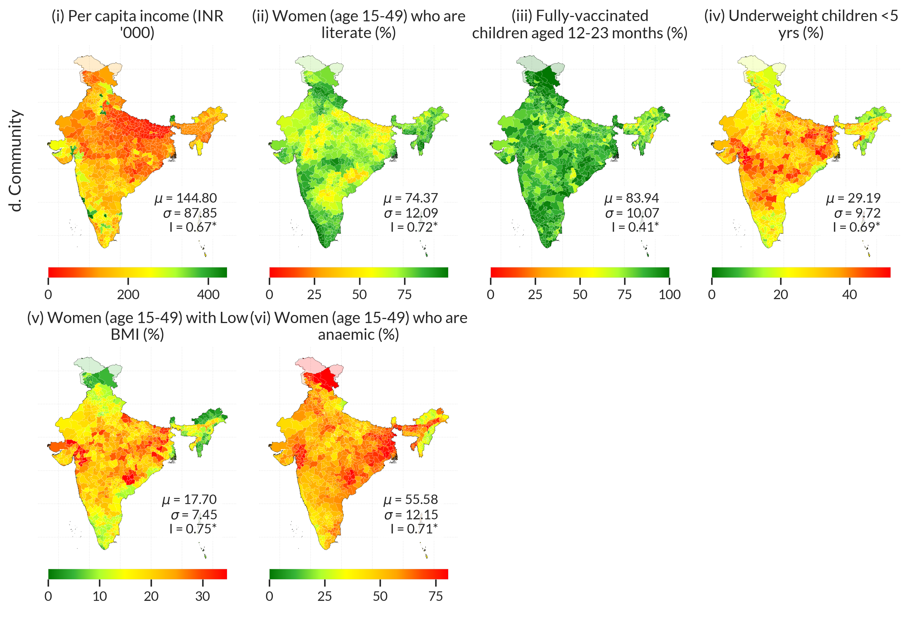

# India District-Level Infrastructure and Community Vulnerability Data

This repository contains open-source data, methodology, and results from a study on district-level infrastructure access, availability, and community vulnerability in India. The study develops composite indicators for critical, essential, and social infrastructure systems, and examines their spatial associations with community vulnerability across 733 districts using spatial regression and clustering analysis.  

The analysis identifies distinct infrastructure profiles that explain spatial inequalities in vulnerability and provides insights for equitable and targeted infrastructure investments.

<!-- This work is a collaboration between researchers at Delft University of Technology and the Indian Institute of Technology Kanpur. Researchers are encouraged to use the data published in this repository for research and policy analysis. -->

If you use this repository in your research or projects, please cite the original study as follows:  

> Balakrishnan, S., S., Shivam and Kothari, C., *Empirical Evidence for Synergistic Influence of Regional Infrastructure Availability and Access on Community Vulnerability*. Available at SSRN: [https://ssrn.com/abstract=5475572](https://ssrn.com/abstract=5475572) (Preprint).

---

## 1. Results and Data

### 1.1 Composite Indicators

Composite indicators for district-level infrastructure characteristics and community vulnerability are calculated across four dimensions:  

- **Critical Infrastructure (CI₍crit₎):** Availability of key physical systems such as road networks, energy grids, and transport connectivity.  
- **Essential Utility Access (CI₍ess₎):** Household-level access to electricity, drinking water, sanitation, and clean cooking fuel.  
- **Social Infrastructure (CI₍soc₎):** Density of educational, health, and safety facilities such as schools, hospitals, and police stations.  
- **Community Vulnerability (CI₍comm₎):** Composite index representing socioeconomic sensitivity, exposure, and adaptive capacity indicators.  

#### 1.1.1 Composite Indicator Maps

All composite indicators are derived by applying **Principal Component Analysis (PCA)** on normalized infrastructure and community features (using standard scaling).  
A positive value indicates above-average capabilities, while a negative value indicates below-average performance.


#### 1.1.2 Data for Download

- [District-level composite infrastructure and vulnerability indices](data/composite_resilience_indices.parquet): District-level composite index values for all infrastructure dimensions and vulnerability (use GeoPandas).  

```python
import geopandas as gpd
gdf = gpd.read_parquet("composite_resilience_indices.parquet")
```

### 1.2 Infrastructure and Vulnerability Data

This section includes the **raw and processed datasets** used to compute infrastructure and vulnerability indicators. These datasets form the basis for reproducing the spatial analysis.

Key indicators include:  
- **Infrastructure indicators:** e.g., road density, hospital availability, utility service coverage.  
- **Vulnerability indicators:** e.g., literacy, household composition, and financial resilience.  

#### 1.2.1 Data Sources

The district-level infrastructure and vulnerability data were compiled from multiple national and open datasets, including:  

- OpenStreetMap  
- ESRI India  
- UDISE+ (Ministry of Education, Government of India)  
- State economic censuses and budget documents  
- National Family Health Survey (NFHS-5), Ministry of Health and Family Welfare  

Please refer to the data dictionary for complete metadata and feature definitions:  
📘 [Resilience Data Dictionary (PDF)](data/resilience_data_dictionary.pdf)

#### 1.2.2 District-Level Feature Maps




#### 1.2.3 Correlation Among Vulnerability and Resilience Characteristics

Correlation analysis was performed using **Kendall’s rank correlation (τ)**.


#### 1.2.4 Download Processed Data

- [District-level infrastructure and vulnerability features](data/resilience_data.parquet): District-level dataset for all indicators (use GeoPandas).  
- [Data dictionary](data/resilience_data_dictionary.pdf): Detailed description of all indicators and data sources.

---

### 1.3 Cluster Analysis: Infrastructure and Vulnerability Profiles

Districts are grouped into **six distinct clusters** based on shared infrastructure and vulnerability characteristics.  
The clustering integrates **spatial regression outputs** and **composite indicators** to reveal inter-district similarities and disparities in access, availability, and social infrastructure.  

- **Clustering method:** Agglomerative Hierarchical Clustering  
- **Validation:** Silhouette and Calinski–Harabasz indices  
- **Outputs:** Spatial cluster maps and average infrastructure profiles per cluster  

#### 1.3.1 Spatial Infrastructure–Vulnerability Profiles

Statistical distributions of infrastructure characteristics were mapped to highlight unique infrastructure profiles and spatial disparities.  


---

## 2. Methods

The methodological framework integrates **spatial econometric modeling** with **composite indicator analysis** to capture multidimensional infrastructure–vulnerability linkages.  

Four main stages were followed:

1. **Indicator Development:**  
   High-resolution geospatial, demographic, and infrastructural datasets were processed and standardized to construct composite indicators for critical, essential, and social infrastructure dimensions, as well as community vulnerability.  

2. **Spatial Analysis:**  
   A **Spatial Lag Model (SLM)** was applied to quantify both direct and spillover associations between infrastructure characteristics and community vulnerability, accounting for spatial dependence across neighboring districts.  

3. **Cluster Analysis:**  
   The resulting marginal effects were aggregated and analyzed through clustering to identify typologies of infrastructure access and availability.  

4. **Statistical Modeling:**  
   The association between community vulnerability and infrastructure dimensions was examined using **linear regression** on the composite indicators.  


---

## 3. Contact

For more details or collaboration inquiries, please contact:  
**Srijith Balakrishnan**  
📧 [s.balakrishnan@tudelft.nl](mailto:s.balakrishnan@tudelft.nl)
