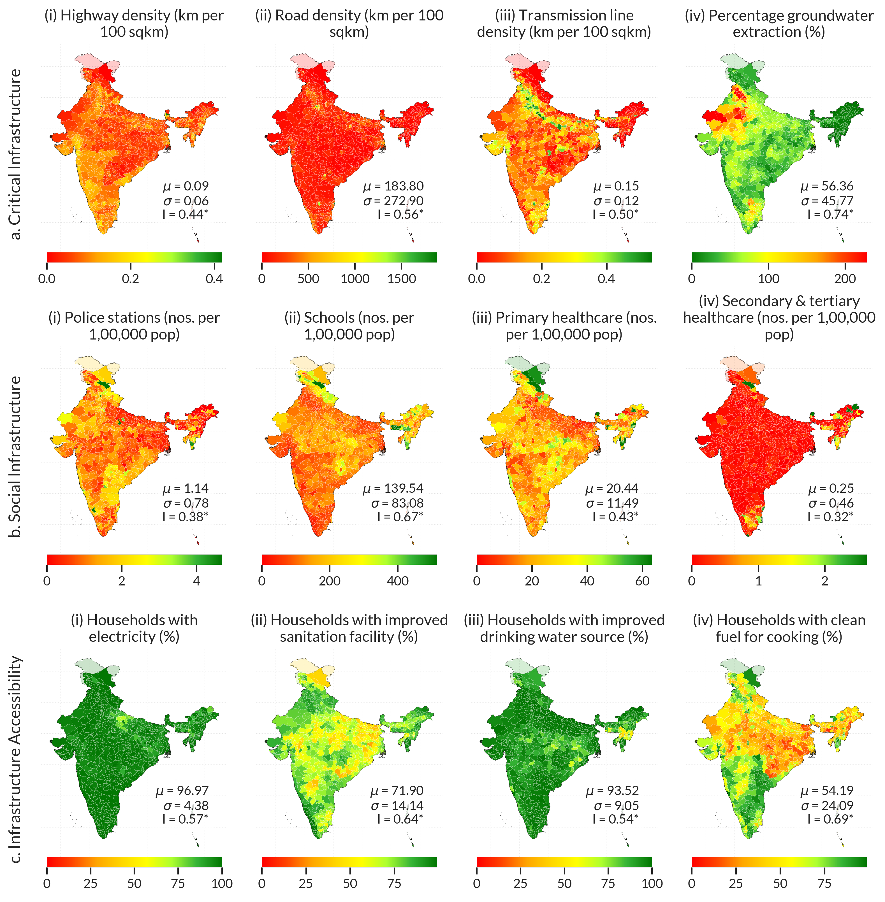

<!--  -->

# India District-level Resilience Data

This repository contains the open-source data, methodology, and results from the study on district-level resilience patterns in India. The study develops composite indices and resilience profiles based on a five-pillar framework, leveraging geospatial tools and clustering algorithms to identify resilience patterns and inform policy interventions. All 733 districts in India are covered.

This is a joint work by researchers at the Delft University of Technology and the Indian Insititue of Technology Kanpur. Researchers are free to use the data published in the repository for their work.

<!-- If you use this repository in your research or projects, please cite the original study as follows:  
> Srijith Balakrishnan, Shivam Srivastava, Chirag Kothari. "Decoding Territorial Resilience Patterns in India", Working Paper. *(2025)*. -->

# Results and Data

Complete analysis can be found [here](india_resilience_analysis.ipynb) (notebook file). For queries on raw data, processing, and further analysis, contact the author.

## 1. **Composite Resilience Indices**
   - ### **Description:**  
     Composite indices for district-level territorial resilience are calculated across five key pillars:  
       - **Critical Infrastructure:** Infrastructure density and robustness (e.g., road and power transmission density).  
       - **Social Infrastructure:** Availability of facilities such as schools, healthcare centers, and police stations.  
       - **Community Resilience:** Socioeconomic characteristics, literacy, vaccination, and household-level financial resilience.  
       - **Infrastructure Service Access:** Access to electricity, sanitation, clean water, and clean cooking fuel.  
       - **State Capacity:** Governance indicators such as public safety, economic governance, and public health.  
   
   - ### **Composite index maps**

     

   - ### **Download data:**  
       - [District-level compisite resilience indices](data/composite_resilience_indices.parquet): District-level composite index values for all resilience pillars (use geopandas).

## 2. **Resilience and Vulnerability Data**
   - ### **Description:**  
     This section includes the raw and processed datasets used to compute resilience and vulnerability indicators. These datasets are critical for replicating the analysis and are categorized as follows:  
       - Resilience indicators (e.g., literacy rates, health infrastructure density).  
       - Vulnerability indicators (e.g., underweight children, low BMI). 

   - ### **Data Sources**    

     The district-level resilience and vulnerability data have been collated/derived from various datasets including OpenStreetMap, ESRI India, UDISE+ (Ministry of Education, Government of India), State economic censuses and budget documents, National Family Health Survey 5 (Ministry of Heath and Family Welfare, Government of India), and Good Governance Index (Department of Administrative Reforms and Public Grievances, Government of India). Please find the data dictionary along with the sources [here](data/resilience_data_dictionary.pdf).
   

   - ### **District-level feature maps**

     
     

   - ### **Download data (pre-processed)**

       - [District-level resilience features](data/resilience_data.parquet): District-level data for all resilience indicators (use geopandas).  
       - [Data dictionary](data/resilience_data_dictionary.pdf): Detailed description of all features and their sources.

## 3. **Case Study: Resilience Patterns in Cyclone-Prone Districts**

   - ### **Description:**  

     A focused analysis on cyclone-prone districts along India's eastern and western coasts. This case study integrates the resilience framework with cyclone hazard data to classify districts into clusters based on their resilience profiles.  
       - Clustering algorithm: Agglomerative clustering  
       - Key outputs include resilience patterns and spatial distributions of clusters.  

   - ### **Clustering of cyclone-prone districts based on resilience capabilities**

     The northern parts of the eastern coast contain several districts with high cyclone risks, coinciding with low resilience capacities.

     

# Methods

The core of the methodology lies in the development of a comprehensive set of indicators based on a five-pillar framework to reflect the multidimensional nature of territorial resilience. These pillars include critical infrastructure, social infrastructure, community, infrastructure service access, and state capacity. For each pillar, we identified relevant features from various sources, including government datasets, surveys, and open-source databases. These features are then standardized and integrated into composite resilience indicators using principal component analysis (PCA), a robust statistical technique for reducing dimensionality and identifying underlying patterns in the data. The remaining stages of the framework build upon this resilience framework. The first step involves gathering and processing the datasets required to develop the resilience indicators. The third step, which is performed parallel to the first two steps, focused on the spatial analysis of hazard characteristics and the development of district-level composite hazard index. Finally, we integrated the resilience indicators with the hazard index to develop district-level hazard-resilience profiles. Using these profiles, we developed distinct resilience patterns that are unique to the hazard-prone regions using appropriate clustering algorithms.

  

## 4. Contact

   - For more details, contact Srijith Balakrishnan. Email: s.balakrishnan@tudelft.nl